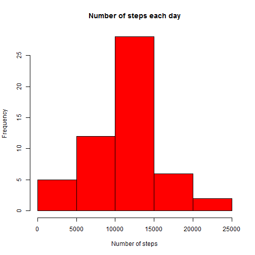
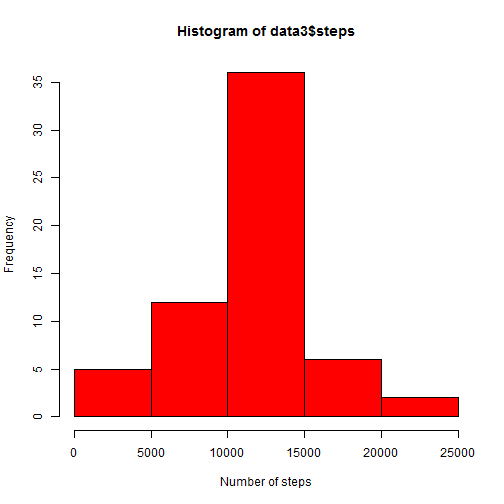

#Peer Assesment 1
 


The complete project is documented here.

### Loading and preprocessing data

Download and unzip the data.


```r
if(!file.exists("getdata-projectfiles-UCI HAR Dataset.zip")) {
   temp <- tempfile()
  download.file("http://d396qusza40orc.cloudfront.net/repdata%2Fdata%2Factivity.zip",temp)
  unzip(temp)
  unlink(temp)
}
```

```
## Warning in
## download.file("http://d396qusza40orc.cloudfront.net/repdata%2Fdata%2Factivity.zip",
## : downloaded length 53559 != reported length 53559
```

Now load the csv file into RStudio


```r
data <- read.csv("activity.csv")
```

###What is mean total number of steps taken per day?

Get rid of NA values


```r
data_nona<-na.omit(data)
```

Now aggregate the dataset and plot the histogram..!!


```r
data_daywise<-aggregate(steps~date,data_nona,sum)
hist(as.numeric(data_daywise$steps),col="red",main="Number of steps each day",xlab="Number of steps")
```

 

The mean and median are calculated


```r
mean_nona<-mean(data_daywise$steps)
median_nona<-median(data_daywise$steps)
```

The average is 1.0766189 &times; 10<sup>4</sup> and the median is 10765 .

###What is the average daily activity pattern?


```r
remove("mean")
```

```
## Warning in remove("mean"): object 'mean' not found
```

```r
 data_intwise<- aggregate(steps ~ interval, data_nona, mean)

plot(data_intwise$interval,data_intwise$steps, type="l", xlab="Interval", ylab="Number of steps",main="Average Number of Steps per Day by Interval")
```

 

The interval for maximum value is. 

```r
maxinterval<-data_intwise[data_intwise$steps==max(data_intwise$steps),1]
print(maxinterval)
```

```
## [1] 835
```

###Imputing missing values

Inputting missing values with the average of their interval value.


```r
imputed_data<-data
for(i in 1:17568){
  if(is.na(imputed_data[i,1])){
    imputed_data[i,1]=data_intwise[data_intwise$interval==imputed_data[i,3],2]
  }
}  
```

Now arregating date wise.


```r
data3 <- aggregate(steps ~ date, imputed_data, sum)
```

Plotting the histogram.


```r
hist(data3$steps,col="red",xlab="Number of steps")
```

 

Calculating the new mean and median and calculating the difference with the old mean and median.


```r
newmean<-mean(data3$steps)
newmedian<-median(data3$steps)
diffmean<-mean_nona-newmean
diffmedian<-median_nona-newmedian
print(diffmean)
```

```
## [1] 0
```

```r
print(diffmedian)
```

```
## [1] -1.188679
```

###Are there differences in activity patterns between weekdays and weekends?

Converting the date column to date class and using weekday function to get the day and keeoing it in a new variable.


```r
imputed_data$date<-as.POSIXct(as.character(imputed_data$date),format="%Y-%m-%d")
imputed_data$day<-weekdays(imputed_data$date,abbreviate=FALSE)
```

Now converting it into two factor levels. Namely "weekday" and "weekend".


```r
for(i in 1:17568){
  if (imputed_data[i,4]=="Sunday"||imputed_data[i,4]=="Saturday"){
    imputed_data[i,4]="weekend"
  }
  else
    imputed_data[i,4]="weekday"
}


imputed_data$day<-as.factor(imputed_data$day)
```

Now making a panel plot.


```r
imputed_data$day<-as.factor(imputed_data$day)
data4<-aggregate(steps~interval+day,imputed_data,mean)
library(lattice)
xyplot(data4$steps~data4$interval|data4$day,layout=c(1,2),type="l",xlab="Intervals",ylab="Average number of steps")
```

 


